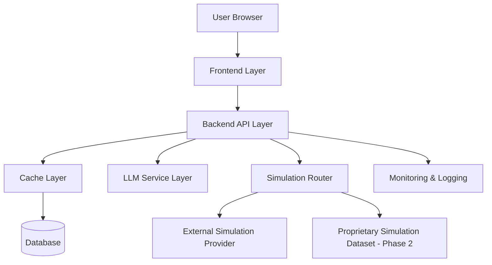
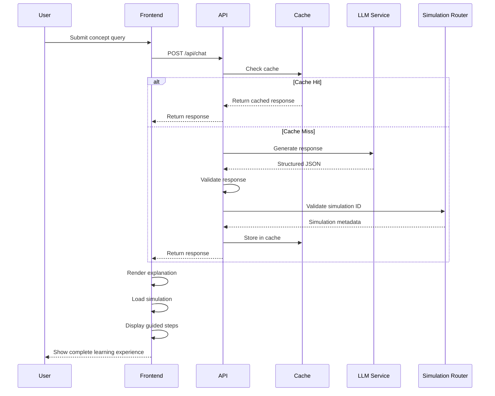

# Design Document: Visual Tutor AI

## Overview

Visual Tutor AI is a web-based educational platform that combines LLM-generated explanations with interactive visual simulations and guided learning steps. The system architecture prioritizes accuracy, cost efficiency, and modularity to support future expansion from external simulation sources (Phase 1 MVP) to proprietary simulation datasets (Phase 2).

The design follows a layered architecture with clear separation of concerns:
- Frontend layer for user interaction
- Backend API layer for orchestration
- Cache layer for response optimization
- LLM service layer for content generation
- Simulation integration layer with source abstraction

## Architecture

### High-Level Architecture Diagram



### Request Flow



## Components and Interfaces

### 1. Frontend Layer

**Technology**: React with TypeScript

**Responsibilities**:
- User input collection and validation
- API communication
- Response rendering
- Simulation embedding via iframe
- Guided steps presentation
- Error handling and user feedback

**Key Components**:

```typescript
// ConceptQueryInput.tsx
interface ConceptQueryInputProps {
  onSubmit: (query: string) => void;
  isLoading: boolean;
}

// Validates input (min 10 chars, non-empty)
// Handles submission and loading states
```

```typescript
// ResponseDisplay.tsx
interface ResponseDisplayProps {
  explanation: string;
  conceptTags: string[];
  simulationUrl: string | null;
  guidedSteps: string[];
  confidenceLevel: 'high' | 'medium' | 'low';
}

// Renders structured response
// Embeds simulation in iframe
// Displays guided steps with progression indicators
```

```typescript
// SimulationEmbed.tsx
interface SimulationEmbedProps {
  simulationUrl: string;
  simulationId: string;
  onLoadError: () => void;
}

// Handles iframe embedding
// Implements security policies (sandbox attributes)
// Graceful error handling if simulation fails to load
```

**API Client**:

```typescript
interface ChatRequest {
  query: string;
}

interface ChatResponse {
  explanation: string;
  concept_tags: string[];
  simulation_identifier: string;
  simulation_url: string | null;
  guided_steps: string[];
  confidence_level: 'high' | 'medium' | 'low';
  simulation_source: 'external' | 'proprietary' | 'none';
}

async function submitQuery(query: string): Promise<ChatResponse> {
  const response = await fetch('/api/chat', {
    method: 'POST',
    headers: { 'Content-Type': 'application/json' },
    body: JSON.stringify({ query })
  });
  
  if (!response.ok) {
    throw new Error(`API error: ${response.status}`);
  }
  
  return response.json();
}
```

### 2. Backend API Layer

**Technology**: Node.js with Express (or Python with FastAPI)

**Responsibilities**:
- Request validation and sanitization
- Cache orchestration
- LLM service integration
- Simulation validation and URL resolution
- Response formatting
- Error handling and logging
- Rate limiting and security

**Core API Endpoint**:

```typescript
// POST /api/chat
interface ChatRequestBody {
  query: string;
}

interface ChatResponseBody {
  explanation: string;
  concept_tags: string[];
  simulation_identifier: string;
  simulation_url: string | null;
  guided_steps: string[];
  confidence_level: 'high' | 'medium' | 'low';
  simulation_source: 'external' | 'proprietary' | 'none';
}

async function handleChatRequest(req: Request, res: Response) {
  // 1. Validate and sanitize input
  const { query } = req.body;
  if (!isValidQuery(query)) {
    return res.status(400).json({ error: 'Invalid query' });
  }
  
  // 2. Normalize query for cache lookup
  const normalizedQuery = normalizeQuery(query);
  
  // 3. Check cache
  const cached = await cacheLayer.get(normalizedQuery);
  if (cached) {
    return res.json(cached);
  }
  
  // 4. Call LLM service
  const llmResponse = await llmService.generate(query);
  
  // 5. Validate LLM response
  if (!validateLLMResponse(llmResponse)) {
    return res.status(500).json({ error: 'Invalid LLM response' });
  }
  
  // 6. Validate and resolve simulation
  const simulationData = await simulationRouter.resolve(
    llmResponse.simulation_identifier
  );
  
  // 7. Build response
  const response: ChatResponseBody = {
    ...llmResponse,
    simulation_url: simulationData.url,
    simulation_source: simulationData.source
  };
  
  // 8. Store in cache
  await cacheLayer.set(normalizedQuery, response);
  
  // 9. Log metrics
  await metricsLogger.log({
    query,
    tokens_used: llmResponse.tokens,
    cache_hit: false,
    timestamp: Date.now()
  });
  
  return res.json(response);
}
```

**Input Validation**:

```typescript
function isValidQuery(query: string): boolean {
  if (!query || typeof query !== 'string') return false;
  
  const trimmed = query.trim();
  if (trimmed.length < 10) return false;
  if (trimmed.length > 500) return false;
  
  // Check for malicious patterns
  if (containsSQLInjection(trimmed)) return false;
  if (containsXSS(trimmed)) return false;
  
  return true;
}

function normalizeQuery(query: string): string {
  return query
    .toLowerCase()
    .trim()
    .replace(/\s+/g, ' ')
    .replace(/^(what is|explain|describe)\s+/i, '');
}
```

### 3. Cache Layer

**Technology**: Redis for in-memory caching with PostgreSQL for persistence

**Responsibilities**:
- Fast cache lookups
- Response storage and retrieval
- Cache key generation
- TTL management
- Cache eviction (LRU strategy)

**Cache Schema**:

```typescript
interface CachedResponse {
  concept_id: string;           // Normalized query hash
  explanation: string;
  concept_tags: string[];
  simulation_identifier: string;
  simulation_url: string | null;
  guided_steps: string[];
  confidence_level: string;
  simulation_source: string;
  timestamp: number;
  access_count: number;         // For analytics
  last_accessed: number;        // For LRU eviction
}
```

**Cache Operations**:

```typescript
class CacheLayer {
  private redis: RedisClient;
  private db: PostgresClient;
  
  async get(normalizedQuery: string): Promise<CachedResponse | null> {
    const cacheKey = this.generateCacheKey(normalizedQuery);
    
    // Try Redis first (fast)
    const cached = await this.redis.get(cacheKey);
    if (cached) {
      await this.updateAccessMetrics(cacheKey);
      return JSON.parse(cached);
    }
    
    // Fallback to database
    const dbResult = await this.db.query(
      'SELECT * FROM response_cache WHERE concept_id = $1',
      [cacheKey]
    );
    
    if (dbResult.rows.length > 0) {
      const response = dbResult.rows[0];
      // Warm up Redis cache
      await this.redis.setex(cacheKey, 3600, JSON.stringify(response));
      await this.updateAccessMetrics(cacheKey);
      return response;
    }
    
    return null;
  }
  
  async set(normalizedQuery: string, response: ChatResponseBody): Promise<void> {
    const cacheKey = this.generateCacheKey(normalizedQuery);
    const cachedResponse: CachedResponse = {
      concept_id: cacheKey,
      ...response,
      timestamp: Date.now(),
      access_count: 0,
      last_accessed: Date.now()
    };
    
    // Store in both Redis and database
    await this.redis.setex(cacheKey, 3600, JSON.stringify(cachedResponse));
    await this.db.query(
      `INSERT INTO response_cache 
       (concept_id, explanation, concept_tags, simulation_identifier, 
        simulation_url, guided_steps, confidence_level, simulation_source,
        timestamp, access_count, last_accessed)
       VALUES ($1, $2, $3, $4, $5, $6, $7, $8, $9, $10, $11)
       ON CONFLICT (concept_id) DO UPDATE SET
       last_accessed = $11, access_count = response_cache.access_count + 1`,
      [
        cachedResponse.concept_id,
        cachedResponse.explanation,
        cachedResponse.concept_tags,
        cachedResponse.simulation_identifier,
        cachedResponse.simulation_url,
        cachedResponse.guided_steps,
        cachedResponse.confidence_level,
        cachedResponse.simulation_source,
        cachedResponse.timestamp,
        cachedResponse.access_count,
        cachedResponse.last_accessed
      ]
    );
  }
  
  private generateCacheKey(normalizedQuery: string): string {
    return crypto.createHash('sha256').update(normalizedQuery).digest('hex');
  }
  
  private async updateAccessMetrics(cacheKey: string): Promise<void> {
    await this.db.query(
      `UPDATE response_cache 
       SET access_count = access_count + 1, last_accessed = $1
       WHERE concept_id = $2`,
      [Date.now(), cacheKey]
    );
  }
  
  async evictLRU(limit: number = 10000): Promise<void> {
    // Keep only the most recently accessed entries
    await this.db.query(
      `DELETE FROM response_cache
       WHERE concept_id NOT IN (
         SELECT concept_id FROM response_cache
         ORDER BY last_accessed DESC
         LIMIT $1
       )`,
      [limit]
    );
  }
}
```

### 4. LLM Service Layer

**Technology**: OpenAI API (GPT-3.5-turbo for simple queries, GPT-4 for complex)

**Responsibilities**:
- LLM API integration
- Prompt construction
- Response parsing and validation
- Token counting and budget enforcement
- Model selection based on query complexity
- Retry logic with exponential backoff

**LLM Service Implementation**:

```typescript
interface LLMResponse {
  explanation: string;
  concept_tags: string[];
  simulation_identifier: string;
  guided_steps: string[];
  confidence_level: 'high' | 'medium' | 'low';
  tokens: number;
}

class LLMService {
  private openai: OpenAIClient;
  private systemPrompt: string;
  private maxPromptTokens: number = 1000;
  private maxResponseTokens: number = 800;
  
  constructor() {
    this.systemPrompt = this.loadSystemPrompt();
  }
  
  async generate(query: string): Promise<LLMResponse> {
    const model = this.selectModel(query);
    const prompt = this.constructPrompt(query);
    
    // Enforce token budget
    const estimatedTokens = this.estimateTokens(prompt);
    if (estimatedTokens > this.maxPromptTokens) {
      throw new Error('Query too long');
    }
    
    try {
      const response = await this.callWithRetry(model, prompt);
      return this.parseResponse(response);
    } catch (error) {
      logger.error('LLM generation failed', { error, query });
      throw error;
    }
  }
  
  private selectModel(query: string): string {
    const complexity = this.assessComplexity(query);
    
    if (complexity === 'simple') {
      return 'gpt-3.5-turbo';
    } else {
      return 'gpt-4-turbo';
    }
  }
  
  private assessComplexity(query: string): 'simple' | 'complex' {
    const lowerQuery = query.toLowerCase();
    
    // Simple indicators
    if (query.length < 50) return 'simple';
    if (lowerQuery.match(/^(what is|define|explain)\s+\w+$/)) return 'simple';
    
    // Complex indicators
    if (lowerQuery.includes('why') || lowerQuery.includes('how')) return 'complex';
    if (lowerQuery.includes('compare') || lowerQuery.includes('analyze')) return 'complex';
    if (lowerQuery.includes('relationship between')) return 'complex';
    
    return 'simple';
  }
  
  private constructPrompt(query: string): string {
    return `${this.systemPrompt}\n\nUser query: ${query}\n\nRespond with valid JSON only.`;
  }
  
  private async callWithRetry(
    model: string,
    prompt: string,
    maxRetries: number = 3
  ): Promise<string> {
    for (let attempt = 0; attempt < maxRetries; attempt++) {
      try {
        const response = await this.openai.chat.completions.create({
          model,
          messages: [
            { role: 'system', content: this.systemPrompt },
            { role: 'user', content: prompt }
          ],
          max_tokens: this.maxResponseTokens,
          temperature: 0.3,
          response_format: { type: 'json_object' }
        });
        
        return response.choices[0].message.content;
      } catch (error) {
        if (attempt === maxRetries - 1) throw error;
        
        // Exponential backoff
        await this.sleep(Math.pow(2, attempt) * 1000);
      }
    }
  }
  
  private parseResponse(rawResponse: string): LLMResponse {
    try {
      const parsed = JSON.parse(rawResponse);
      
      // Validate required fields
      if (!parsed.explanation || !parsed.concept_tags || 
          !parsed.simulation_identifier || !parsed.guided_steps) {
        throw new Error('Missing required fields');
      }
      
      // Validate field types and constraints
      if (typeof parsed.explanation !== 'string') {
        throw new Error('Invalid explanation type');
      }
      
      if (!Array.isArray(parsed.concept_tags) || 
          parsed.concept_tags.length < 3 || 
          parsed.concept_tags.length > 5) {
        throw new Error('Invalid concept_tags');
      }
      
      if (!Array.isArray(parsed.guided_steps) || 
          parsed.guided_steps.length < 3 || 
          parsed.guided_steps.length > 5) {
        throw new Error('Invalid guided_steps');
      }
      
      return {
        explanation: parsed.explanation,
        concept_tags: parsed.concept_tags,
        simulation_identifier: parsed.simulation_identifier,
        guided_steps: parsed.guided_steps,
        confidence_level: parsed.confidence_level || 'medium',
        tokens: this.estimateTokens(rawResponse)
      };
    } catch (error) {
      logger.error('Failed to parse LLM response', { error, rawResponse });
      throw new Error('Invalid LLM response format');
    }
  }
  
  private loadSystemPrompt(): string {
    // Load from prompt.md or configuration
    return `You are an expert educational tutor specializing in clear, structured concept explanations. Your role is to:
- Provide accurate, concise explanations of educational concepts
- Break down complex topics into digestible learning steps
- Suggest relevant visual simulations to enhance understanding
- Maintain academic rigor and conceptual accuracy
- Generate responses in a strict JSON format for machine parsing

CRITICAL: You MUST respond with valid JSON only. No additional text before or after the JSON object.

Required JSON format:
{
  "explanation": "string (200-500 words)",
  "concept_tags": ["string", "string", "string"],
  "simulation_identifier": "string",
  "guided_steps": ["string", "string", "string"],
  "confidence_level": "high | medium | low"
}`;
  }
  
  private estimateTokens(text: string): number {
    // Rough estimation: 1 token ≈ 4 characters
    return Math.ceil(text.length / 4);
  }
  
  private sleep(ms: number): Promise<void> {
    return new Promise(resolve => setTimeout(resolve, ms));
  }
}
```

### 5. Simulation Router

**Responsibilities**:
- Simulation identifier validation against whitelist
- URL resolution for external simulations
- Source abstraction (external vs proprietary)
- Simulation metadata management
- Security enforcement

**Simulation Router Implementation**:

```typescript
interface SimulationMetadata {
  identifier: string;
  url: string | null;
  source: 'external' | 'proprietary' | 'none';
  provider: string;
  isAvailable: boolean;
}

class SimulationRouter {
  private whitelist: Map<string, SimulationMetadata>;
  
  constructor() {
    this.whitelist = this.loadWhitelist();
  }
  
  async resolve(identifier: string): Promise<SimulationMetadata> {
    // Handle "none" case
    if (identifier === 'none') {
      return {
        identifier: 'none',
        url: null,
        source: 'none',
        provider: 'none',
        isAvailable: false
      };
    }
    
    // Validate against whitelist
    if (!this.whitelist.has(identifier)) {
      logger.warn('Invalid simulation identifier', { identifier });
      return {
        identifier,
        url: null,
        source: 'none',
        provider: 'unknown',
        isAvailable: false
      };
    }
    
    const metadata = this.whitelist.get(identifier);
    
    // Check availability (could ping the URL)
    const isAvailable = await this.checkAvailability(metadata.url);
    
    return {
      ...metadata,
      isAvailable
    };
  }
  
  private loadWhitelist(): Map<string, SimulationMetadata> {
    const whitelist = new Map<string, SimulationMetadata>();
    
    // PhET simulations
    whitelist.set('phet-forces-and-motion', {
      identifier: 'phet-forces-and-motion',
      url: 'https://phet.colorado.edu/sims/html/forces-and-motion-basics/latest/forces-and-motion-basics_en.html',
      source: 'external',
      provider: 'PhET',
      isAvailable: true
    });
    
    whitelist.set('phet-wave-interference', {
      identifier: 'phet-wave-interference',
      url: 'https://phet.colorado.edu/sims/html/wave-interference/latest/wave-interference_en.html',
      source: 'external',
      provider: 'PhET',
      isAvailable: true
    });
    
    whitelist.set('phet-circuit-construction', {
      identifier: 'phet-circuit-construction',
      url: 'https://phet.colorado.edu/sims/html/circuit-construction-kit-dc/latest/circuit-construction-kit-dc_en.html',
      source: 'external',
      provider: 'PhET',
      isAvailable: true
    });
    
    // GeoGebra simulations
    whitelist.set('geogebra-calculus-derivatives', {
      identifier: 'geogebra-calculus-derivatives',
      url: 'https://www.geogebra.org/m/derivative-calculator',
      source: 'external',
      provider: 'GeoGebra',
      isAvailable: true
    });
    
    whitelist.set('geogebra-geometry-transformations', {
      identifier: 'geogebra-geometry-transformations',
      url: 'https://www.geogebra.org/m/geometric-transformations',
      source: 'external',
      provider: 'GeoGebra',
      isAvailable: true
    });
    
    // Add more simulations as needed
    
    return whitelist;
  }
  
  private async checkAvailability(url: string | null): Promise<boolean> {
    if (!url) return false;
    
    try {
      const response = await fetch(url, { method: 'HEAD', timeout: 5000 });
      return response.ok;
    } catch (error) {
      logger.warn('Simulation availability check failed', { url, error });
      return false;
    }
  }
  
  // Phase 2: Add proprietary simulation support
  async addProprietarySimulation(metadata: SimulationMetadata): Promise<void> {
    this.whitelist.set(metadata.identifier, {
      ...metadata,
      source: 'proprietary'
    });
    
    // Persist to database
    await this.db.query(
      `INSERT INTO simulation_whitelist 
       (identifier, url, source, provider, is_available)
       VALUES ($1, $2, $3, $4, $5)`,
      [metadata.identifier, metadata.url, metadata.source, 
       metadata.provider, metadata.isAvailable]
    );
  }
}
```

## Data Models

### Database Schema

```sql
-- Response cache table
CREATE TABLE response_cache (
  concept_id VARCHAR(64) PRIMARY KEY,
  explanation TEXT NOT NULL,
  concept_tags TEXT[] NOT NULL,
  simulation_identifier VARCHAR(255) NOT NULL,
  simulation_url TEXT,
  guided_steps TEXT[] NOT NULL,
  confidence_level VARCHAR(20) NOT NULL,
  simulation_source VARCHAR(20) NOT NULL,
  timestamp BIGINT NOT NULL,
  access_count INTEGER DEFAULT 0,
  last_accessed BIGINT NOT NULL,
  created_at TIMESTAMP DEFAULT CURRENT_TIMESTAMP
);

CREATE INDEX idx_last_accessed ON response_cache(last_accessed DESC);
CREATE INDEX idx_concept_tags ON response_cache USING GIN(concept_tags);

-- Simulation whitelist table
CREATE TABLE simulation_whitelist (
  identifier VARCHAR(255) PRIMARY KEY,
  url TEXT,
  source VARCHAR(20) NOT NULL,
  provider VARCHAR(100) NOT NULL,
  is_available BOOLEAN DEFAULT true,
  quality_score DECIMAL(3,2),
  usage_count INTEGER DEFAULT 0,
  created_at TIMESTAMP DEFAULT CURRENT_TIMESTAMP,
  updated_at TIMESTAMP DEFAULT CURRENT_TIMESTAMP
);

CREATE INDEX idx_provider ON simulation_whitelist(provider);
CREATE INDEX idx_source ON simulation_whitelist(source);

-- API usage metrics table
CREATE TABLE api_metrics (
  id SERIAL PRIMARY KEY,
  query_hash VARCHAR(64) NOT NULL,
  model_used VARCHAR(50) NOT NULL,
  tokens_used INTEGER NOT NULL,
  cache_hit BOOLEAN NOT NULL,
  response_time_ms INTEGER NOT NULL,
  timestamp BIGINT NOT NULL,
  created_at TIMESTAMP DEFAULT CURRENT_TIMESTAMP
);

CREATE INDEX idx_timestamp ON api_metrics(timestamp DESC);
CREATE INDEX idx_cache_hit ON api_metrics(cache_hit);

-- User sessions table (for future Phase 2 features)
CREATE TABLE user_sessions (
  session_id VARCHAR(64) PRIMARY KEY,
  user_id VARCHAR(64),
  proficiency_level VARCHAR(20),
  interaction_count INTEGER DEFAULT 0,
  created_at TIMESTAMP DEFAULT CURRENT_TIMESTAMP,
  last_active TIMESTAMP DEFAULT CURRENT_TIMESTAMP
);
```

### TypeScript Type Definitions

```typescript
// Core domain types
type ConceptTag = string;
type SimulationIdentifier = string;
type ConfidenceLevel = 'high' | 'medium' | 'low';
type SimulationSource = 'external' | 'proprietary' | 'none';

interface ConceptQuery {
  query: string;
  sessionId?: string;
}

interface StructuredResponse {
  explanation: string;
  conceptTags: ConceptTag[];
  simulationIdentifier: SimulationIdentifier;
  simulationUrl: string | null;
  guidedSteps: string[];
  confidenceLevel: ConfidenceLevel;
  simulationSource: SimulationSource;
}

interface CacheEntry extends StructuredResponse {
  conceptId: string;
  timestamp: number;
  accessCount: number;
  lastAccessed: number;
}

interface SimulationMetadata {
  identifier: SimulationIdentifier;
  url: string | null;
  source: SimulationSource;
  provider: string;
  isAvailable: boolean;
  qualityScore?: number;
  usageCount?: number;
}

interface APIMetrics {
  queryHash: string;
  modelUsed: string;
  tokensUsed: number;
  cacheHit: boolean;
  responseTimeMs: number;
  timestamp: number;
}
```

## Correctness Properties

*A property is a characteristic or behavior that should hold true across all valid executions of a system—essentially, a formal statement about what the system should do. Properties serve as the bridge between human-readable specifications and machine-verifiable correctness guarantees.*


### Property Reflection

After analyzing all acceptance criteria, I identified the following redundancies:
- Properties 1.2 and 1.3 both test whitespace rejection (combine into one)
- Properties 2.3-2.6 all test response structure (combine into comprehensive validation)
- Properties 2.7 and 12.1-12.2 duplicate response validation (already covered)
- Properties 4.1 and 4.2 both test whitelist validation (combine)
- Properties 4.1 and 8.2 duplicate whitelist validation (combine)
- Property 5.1 duplicates 2.6 for guided steps count (already covered)
- Property 7.3 duplicates 2.3-2.6 for response structure (already covered)
- Property 10.3 duplicates 3.3 for cache entry structure (already covered)

The following properties provide unique validation value and will be implemented:

1. Input validation (length and whitespace)
2. Response structure validation (comprehensive)
3. Cache-first behavior
4. Cache hit avoids LLM calls
5. Cache entry persistence
6. Simulation whitelist validation
7. Simulation ID to URL mapping
8. Guided steps display order
9. Token budget enforcement
10. API usage logging structure
11. Prompt truncation for long inputs
12. Model selection based on complexity
13. Request parsing validation
14. HTTP status codes
15. Input sanitization
16. HTTPS enforcement for simulations
17. Rate limiting
18. LRU cache eviction
19. Graceful degradation without simulation
20. Retry logic with exponential backoff
21. Cache fallback to LLM
22. Guided steps boundary validation

### Correctness Properties


Property 1: Input Length Validation
*For any* user input string, the system should accept it if and only if the trimmed length is at least 10 characters
**Validates: Requirements 1.1**

Property 2: Whitespace-Only Input Rejection
*For any* string composed entirely of whitespace characters, the system should reject it and return an error message
**Validates: Requirements 1.2, 1.3**

Property 3: Structured Response Completeness
*For any* LLM-generated response, it should contain all required fields: explanation (non-empty string), concept_tags (array of 3-5 strings), simulation_identifier (string), guided_steps (array of 3-5 strings), and confidence_level (valid enum)
**Validates: Requirements 2.2, 2.3, 2.4, 2.5, 2.6**

Property 4: Cache-First Lookup
*For any* concept query, the system should check the cache before making an LLM API call
**Validates: Requirements 3.1**

Property 5: Cache Hit Prevents LLM Call
*For any* concept query that exists in cache, the system should return the cached response without invoking the LLM service
**Validates: Requirements 3.2**

Property 6: Cache Entry Structure
*For any* response stored in cache, it should contain concept_id, explanation, concept_tags, simulation_identifier, simulation_url, guided_steps, confidence_level, simulation_source, timestamp, access_count, and last_accessed fields
**Validates: Requirements 3.3**

Property 7: Simulation Whitelist Validation
*For any* simulation identifier (except "none"), the system should accept it if and only if it exists in the approved whitelist
**Validates: Requirements 4.1, 4.2, 8.2**

Property 8: Simulation ID to URL Mapping
*For any* whitelisted simulation identifier, the system should return a valid HTTPS URL or null
**Validates: Requirements 4.5**


Property 9: Guided Steps Display Order Preservation
*For any* array of guided steps, the frontend should display them in the same sequential order as provided in the response
**Validates: Requirements 5.2**

Property 10: Token Budget Enforcement
*For any* LLM API request, if the estimated token count exceeds the maximum budget, the system should reject or truncate the request
**Validates: Requirements 6.1**

Property 11: API Usage Logging Completeness
*For any* LLM API call, the system should log an entry containing query_hash, model_used, tokens_used, cache_hit, response_time_ms, and timestamp
**Validates: Requirements 6.2**

Property 12: Prompt Truncation for Long Inputs
*For any* query that would exceed the token budget, the system should truncate or optimize the prompt to fit within limits
**Validates: Requirements 6.3**

Property 13: Model Selection Based on Complexity
*For any* query classified as "simple" (length < 50 chars or basic definition pattern), the system should select a lower-cost model (e.g., GPT-3.5-turbo)
**Validates: Requirements 6.4**

Property 14: API Request Parsing
*For any* POST request to /api/chat with valid JSON containing a "query" field, the system should successfully parse and process it
**Validates: Requirements 7.2**

Property 15: Successful Response Status Code
*For any* successfully processed request, the system should return HTTP status code 200
**Validates: Requirements 7.5**


Property 16: Input Sanitization
*For any* user input containing potentially malicious patterns (SQL injection, XSS), the system should sanitize or reject it
**Validates: Requirements 8.1**

Property 17: HTTPS Enforcement for Simulations
*For any* simulation URL returned by the system, it should use the HTTPS protocol or be null
**Validates: Requirements 8.3**

Property 18: Rate Limiting
*For any* client making requests to /api/chat, if the request rate exceeds the configured limit within a time window, subsequent requests should be throttled or rejected
**Validates: Requirements 8.5**

Property 19: LRU Cache Eviction
*For any* cache that grows beyond the maximum size limit (10,000 entries), the system should evict the least recently accessed entries first
**Validates: Requirements 9.4**

Property 20: Graceful Degradation Without Simulation
*For any* response where the simulation cannot be loaded or is unavailable, the system should still return the explanation and guided steps successfully
**Validates: Requirements 11.2**

Property 21: Retry Logic with Exponential Backoff
*For any* transient LLM API failure, the system should retry the request with exponentially increasing delays (e.g., 1s, 2s, 4s) up to a maximum number of attempts
**Validates: Requirements 11.4**

Property 22: Cache Unavailability Fallback
*For any* request when the cache layer is unavailable, the system should successfully complete the request by calling the LLM service directly
**Validates: Requirements 11.5**


Property 23: Guided Steps Boundary Validation
*For any* LLM response, if the guided_steps array contains fewer than 3 or more than 5 steps, the system should log a warning but still accept the response
**Validates: Requirements 12.4**

## Error Handling

### Error Categories and Responses

The system implements comprehensive error handling across all layers:

**1. Input Validation Errors**
- Invalid query length (< 10 characters)
- Whitespace-only input
- Malicious input patterns
- Response: 400 Bad Request with descriptive error message

**2. LLM Service Errors**
- API unavailability
- Malformed JSON response
- Missing required fields
- Token budget exceeded
- Response: Retry with exponential backoff (up to 3 attempts), then return fallback response

**3. Cache Layer Errors**
- Redis connection failure
- Database unavailability
- Response: Continue operation using LLM service directly (graceful degradation)

**4. Simulation Errors**
- Invalid simulation identifier
- Simulation URL unavailable
- Embedding failure
- Response: Return explanation and guided steps without simulation

**5. Rate Limiting Errors**
- Too many requests from client
- Response: 429 Too Many Requests with retry-after header

### Fallback Response Strategy

When all retry attempts fail, the system returns a structured fallback response:

```json
{
  "explanation": "We're experiencing technical difficulties generating a detailed explanation. Please try rephrasing your question or try again in a moment.",
  "concept_tags": ["error-fallback"],
  "simulation_identifier": "none",
  "simulation_url": null,
  "guided_steps": [
    "Rephrase your question to be more specific",
    "Try breaking down your question into smaller parts",
    "Check back in a moment as we resolve technical issues"
  ],
  "confidence_level": "low",
  "simulation_source": "none"
}
```


### Error Logging

All errors are logged with structured data for debugging and monitoring:

```typescript
interface ErrorLog {
  errorType: string;
  errorMessage: string;
  stackTrace?: string;
  context: {
    query?: string;
    userId?: string;
    sessionId?: string;
    timestamp: number;
  };
  severity: 'low' | 'medium' | 'high' | 'critical';
}
```

## Testing Strategy

### Dual Testing Approach

The Visual Tutor AI system requires both unit tests and property-based tests for comprehensive coverage:

**Unit Tests** focus on:
- Specific examples demonstrating correct behavior
- Edge cases (empty responses, malformed JSON, unavailable simulations)
- Error conditions (LLM failures, cache failures, invalid inputs)
- Integration points between components
- HTTP endpoint behavior with specific payloads

**Property-Based Tests** focus on:
- Universal properties that hold for all inputs
- Input validation across random generated data
- Response structure validation with varied LLM outputs
- Cache behavior with random queries
- Simulation whitelist validation with random identifiers
- Comprehensive input coverage through randomization

### Property-Based Testing Configuration

**Testing Library**: Use fast-check (JavaScript/TypeScript) or Hypothesis (Python)

**Test Configuration**:
- Minimum 100 iterations per property test
- Each test references its design document property
- Tag format: `Feature: visual-tutor-ai, Property {number}: {property_text}`

**Example Property Test Structure**:

```typescript
import fc from 'fast-check';

describe('Feature: visual-tutor-ai, Property 1: Input Length Validation', () => {
  it('should accept inputs with trimmed length >= 10 characters', () => {
    fc.assert(
      fc.property(
        fc.string({ minLength: 10 }),
        (input) => {
          const result = validateInput(input);
          expect(result.isValid).toBe(true);
        }
      ),
      { numRuns: 100 }
    );
  });
  
  it('should reject inputs with trimmed length < 10 characters', () => {
    fc.assert(
      fc.property(
        fc.string({ maxLength: 9 }),
        (input) => {
          const result = validateInput(input);
          expect(result.isValid).toBe(false);
        }
      ),
      { numRuns: 100 }
    );
  });
});
```


### Unit Test Examples

**Input Validation Tests**:
```typescript
describe('Input Validation', () => {
  it('should reject empty string', () => {
    expect(validateInput('')).toEqual({ isValid: false, error: 'Query too short' });
  });
  
  it('should reject whitespace-only string', () => {
    expect(validateInput('   \t\n  ')).toEqual({ isValid: false, error: 'Query too short' });
  });
  
  it('should accept valid 10-character query', () => {
    expect(validateInput('What is AI')).toEqual({ isValid: true });
  });
});
```

**Cache Behavior Tests**:
```typescript
describe('Cache Layer', () => {
  it('should return cached response on cache hit', async () => {
    const query = 'What is photosynthesis';
    const cachedResponse = { explanation: 'Cached...', /* ... */ };
    
    await cache.set(query, cachedResponse);
    const result = await cache.get(query);
    
    expect(result).toEqual(cachedResponse);
  });
  
  it('should return null on cache miss', async () => {
    const result = await cache.get('never-cached-query');
    expect(result).toBeNull();
  });
});
```

**Simulation Whitelist Tests**:
```typescript
describe('Simulation Router', () => {
  it('should accept whitelisted simulation identifier', async () => {
    const result = await simulationRouter.resolve('phet-forces-and-motion');
    expect(result.isAvailable).toBe(true);
    expect(result.url).toMatch(/^https:\/\//);
  });
  
  it('should reject non-whitelisted simulation identifier', async () => {
    const result = await simulationRouter.resolve('malicious-sim');
    expect(result.isAvailable).toBe(false);
    expect(result.url).toBeNull();
  });
  
  it('should handle "none" identifier', async () => {
    const result = await simulationRouter.resolve('none');
    expect(result.source).toBe('none');
    expect(result.url).toBeNull();
  });
});
```

### Integration Tests

Integration tests verify end-to-end workflows:

```typescript
describe('End-to-End Chat Flow', () => {
  it('should complete full request cycle with cache miss', async () => {
    const query = 'Explain quantum entanglement';
    
    const response = await request(app)
      .post('/api/chat')
      .send({ query })
      .expect(200);
    
    expect(response.body).toHaveProperty('explanation');
    expect(response.body).toHaveProperty('concept_tags');
    expect(response.body).toHaveProperty('simulation_identifier');
    expect(response.body).toHaveProperty('guided_steps');
    expect(response.body.guided_steps).toHaveLength(expect.any(Number));
    expect(response.body.guided_steps.length).toBeGreaterThanOrEqual(3);
    expect(response.body.guided_steps.length).toBeLessThanOrEqual(5);
  });
  
  it('should return cached response on second identical request', async () => {
    const query = 'What is Newton\'s second law';
    
    // First request
    const response1 = await request(app)
      .post('/api/chat')
      .send({ query })
      .expect(200);
    
    // Second request (should hit cache)
    const response2 = await request(app)
      .post('/api/chat')
      .send({ query })
      .expect(200);
    
    expect(response1.body).toEqual(response2.body);
  });
});
```


### Test Coverage Goals

- Unit test coverage: > 80% of code paths
- Property test coverage: All 23 correctness properties implemented
- Integration test coverage: All major user workflows
- Edge case coverage: All error conditions and boundary cases

### Continuous Testing

- Run unit tests on every commit
- Run property tests (100 iterations) on every pull request
- Run integration tests before deployment
- Monitor property test failures in production logs

## Security Considerations

### Input Security

1. **SQL Injection Prevention**: Use parameterized queries for all database operations
2. **XSS Prevention**: Sanitize all user inputs before processing or display
3. **Command Injection Prevention**: Never execute user input as system commands
4. **Input Length Limits**: Enforce maximum query length (500 characters)

### API Security

1. **Authentication**: Implement API key or JWT-based authentication
2. **Rate Limiting**: Prevent abuse with per-client rate limits
3. **CORS Configuration**: Restrict API access to approved domains
4. **HTTPS Only**: Enforce HTTPS for all API communications

### Simulation Security

1. **Whitelist-Only**: Never embed arbitrary URLs
2. **Iframe Sandboxing**: Use sandbox attributes to restrict iframe capabilities
3. **Content Security Policy**: Implement CSP headers to prevent XSS
4. **HTTPS Enforcement**: Only embed simulations over HTTPS

### Credential Management

1. **Environment Variables**: Store API keys in environment variables
2. **Secret Management**: Use secret management services (AWS Secrets Manager, HashiCorp Vault)
3. **Key Rotation**: Implement regular API key rotation
4. **Least Privilege**: Grant minimum necessary permissions

## Performance Optimization

### Caching Strategy

1. **Multi-Tier Caching**: Redis (fast) + PostgreSQL (persistent)
2. **Cache Warming**: Pre-populate cache with common queries
3. **TTL Management**: Set appropriate time-to-live for cache entries
4. **Cache Invalidation**: Implement cache invalidation for updated content

### Database Optimization

1. **Indexing**: Create indexes on frequently queried fields (last_accessed, concept_tags)
2. **Connection Pooling**: Use connection pools to reduce overhead
3. **Query Optimization**: Optimize slow queries identified through monitoring
4. **Partitioning**: Consider table partitioning for large datasets

### API Optimization

1. **Response Compression**: Enable gzip compression for API responses
2. **Payload Minimization**: Return only necessary fields
3. **Async Processing**: Use async/await for non-blocking operations
4. **Load Balancing**: Distribute traffic across multiple instances

## Monitoring and Observability

### Key Metrics

1. **Cache Hit Rate**: Target > 60%
2. **Average Response Time**: Target < 3 seconds
3. **LLM Token Usage**: Track daily/monthly consumption
4. **Error Rate**: Target < 1% of requests
5. **API Availability**: Target > 99.5% uptime

### Logging Strategy

```typescript
interface LogEntry {
  level: 'debug' | 'info' | 'warn' | 'error' | 'critical';
  message: string;
  timestamp: number;
  context: {
    requestId?: string;
    userId?: string;
    query?: string;
    cacheHit?: boolean;
    tokensUsed?: number;
    responseTime?: number;
  };
}
```

### Alerting

Set up alerts for:
- Error rate exceeds 5%
- Cache hit rate drops below 40%
- Average response time exceeds 5 seconds
- LLM API failures exceed 10% of requests
- Token usage exceeds daily budget

## Deployment Architecture

### Infrastructure Components

1. **Frontend**: Static hosting (Vercel, Netlify, CloudFront + S3)
2. **Backend API**: Container-based deployment (ECS, Kubernetes, Cloud Run)
3. **Redis Cache**: Managed Redis service (ElastiCache, Redis Cloud)
4. **PostgreSQL**: Managed database service (RDS, Cloud SQL)
5. **Load Balancer**: Application load balancer for traffic distribution

### Environment Configuration

**Development**:
- Local Redis and PostgreSQL instances
- Mock LLM service for testing
- Relaxed rate limits

**Staging**:
- Managed cache and database services
- Real LLM API with lower token budget
- Production-like configuration

**Production**:
- High-availability setup with redundancy
- Auto-scaling based on load
- Full monitoring and alerting
- Production LLM API with full token budget

## Future Enhancements (Phase 2)

### Proprietary Simulation Dataset

When resources and demand justify development:

1. **Simulation Creation Pipeline**: Tools for creating custom simulations
2. **Quality Assurance**: Academic review process for new simulations
3. **Analytics-Driven Prioritization**: Build simulations for high-demand concepts
4. **Version Control**: Track simulation versions and updates
5. **A/B Testing**: Compare proprietary vs external simulations

### Semantic Caching with Embeddings

Improve cache hit rate for semantically similar queries:

1. **Embedding Generation**: Generate embeddings for all queries
2. **Vector Database**: Store embeddings in vector database (Pinecone, Weaviate)
3. **Similarity Search**: Find semantically similar cached responses
4. **Threshold Configuration**: Set similarity threshold for cache hits (e.g., 0.85)

### Adaptive Difficulty and Student Profiling

Personalize learning experiences:

1. **User Tracking**: Track user interactions and performance
2. **Proficiency Assessment**: Classify users as beginner/intermediate/advanced
3. **Adaptive Prompting**: Adjust explanation complexity based on proficiency
4. **Progress Tracking**: Show learning progress over time
5. **Recommendation Engine**: Suggest related concepts to study

### Multi-Modal Content

Expand beyond text and simulations:

1. **Diagram Generation**: Generate custom diagrams for concepts
2. **Practice Problems**: Include interactive practice problems
3. **Video Integration**: Embed relevant educational videos
4. **Audio Explanations**: Provide audio versions of explanations

## Conclusion

This design provides a robust, scalable foundation for the Visual Tutor AI platform. The architecture prioritizes accuracy, cost efficiency, and modularity to support both the Phase 1 MVP (external simulations) and future Phase 2 expansion (proprietary simulations and advanced features). The comprehensive testing strategy, including 23 correctness properties, ensures system reliability and correctness across all components.
